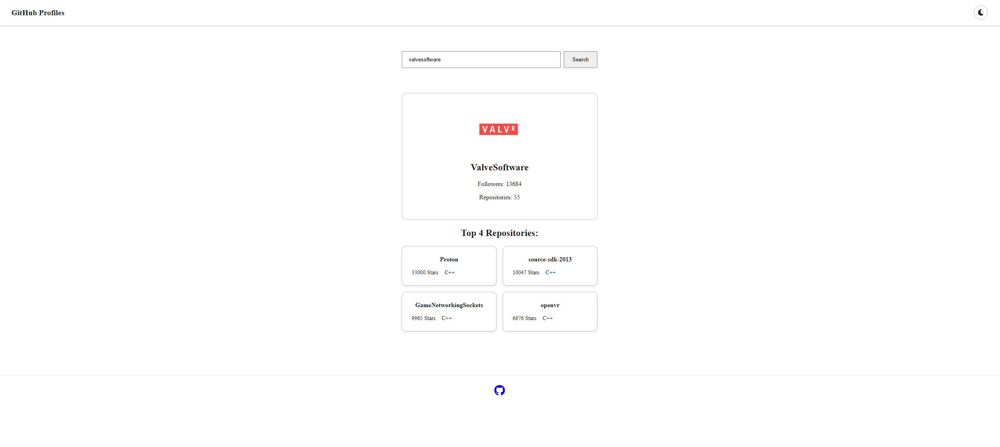

## Challenge from [florinpop17's app-ideas](https://github.com/florinpop17/app-ideas)

**Tier:** 2-Intermediate

APIs allow you to use the real world data that drives platforms like GitHub. You can communicate with the remote servers and get data that you can use to build an app.

In this project you create a search app that uses GitHub API to retrieve user information when a valid username is input. It should display avatar, username, followers count, repository count, top 4 repositories based on forks and stars.

## User Stories

-   [X] User can enter a username
-   [X] User can click on search button to retrieve information
-   [X] User can see the avatar, username, followers and repository count of searched user
-   [X] User can see the top 4 repositories of searched user
-   [X] User should get an alert if the username is not valid

## Bonus features
-  [X] User can toggle dark/light mode
-  [X] Selected mode should persist when user comes back to the app again

## Useful links and resources
To get the data you need to communicate with GitHub API. you can either

- [Read Docs](https://developer.github.com/v3/)

To get data from API you can check [fetch API](https://developer.mozilla.org/en-US/docs/Web/API/Fetch_API/Using_Fetch) in javascript

## Preview:
